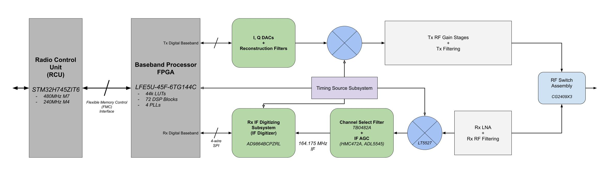

# Overview
This repository contains the hardware and software components of my open TETRA V1.0 project. The goal of this project is to implement a TETRA V1.0 V+D compliant Mobile Station (MS) from the ground up. While this is a personal project, with the aim to sharpen my VHDL, RF design, and C++ skills, my hope is that it can have some use for someone.

# Current State
While this is a hardware focused project, it is necessary to develop an in-depth python emulation of the TETRA V1.0 standard in order to support hardware development. So while hardware design and development has already started, the current work emphasis is on completing the python emulation to provide the following:

1. Logical and burst layer binary data to design and verify FPGA digital blocks
2. RF Burst waveforms to support Rx IF AGC design work, and verification
3. The ability to simulate the effect of RF impairments in the baseband processing design such as adjacent (within channel select filter) and co-channel interference, fading, frequency offsets, on BER and MER
4. Provide a platform to verify not only lower MAC performance with IQ waveforms, but also upper MAC behaviour by acting as a BS emulator in-loop with a PlutoSDR

## Hardware
System level design of the Rx portion of the RF front end is underway, an RF analysis of the Rx chain is 60% complete, and many components have been selected. A basic block diagram is provided below, not all Rx detail is included at this moment.

### Short Term Hardware Goals
1. Begin development and verification of FPGA digital blocks using a LFE5U-45F Lattice FPGA dev. board
2. Complete Rx RF + IF design, and complete schematic capture and layout of RF+IF subsystem test board

## Software
Software development of a python TETRA V1.0 emulator is well underway, and approximately 50% complete. The following has been accomplished, and is further detailed in the `/software` directory:
1. Complete Lower MAC layer implementation
2. Complete TDMA burst construction using logical channels

### Short Term Software Goals
1. Complete baseband sampling, filtering, and power ramping to generate burst I,Q waveforms for PlutoSDR
2. Receiver synchronization, sampling, filtering and BER/MER simulations
3. Work on Upper MAC layer and LLC, to utilize logical channels and fill them with actual data