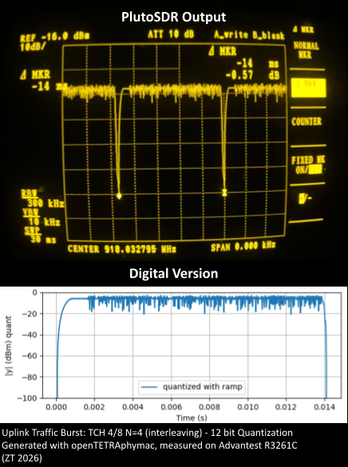
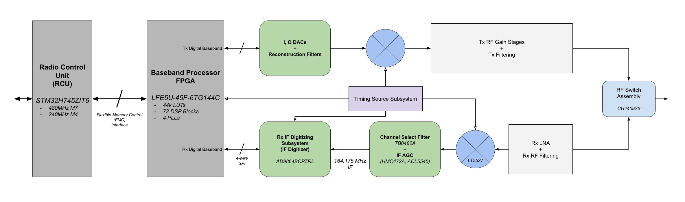

# Overview
This repository contains the hardware and software components of my open TETRA V1.0 project. The goal of this project is to implement a TETRA V1.0 V+D compliant Mobile Station (MS) from the ground up. While this is a personal project, with the aim to sharpen my VHDL, RF design, and C++ skills, my hope is that it can have some use for someone.

# Current State
While this is a hardware focused project, it is necessary to develop an in-depth python emulation of the TETRA V1.0 standard in order to support hardware development. So while hardware design and development has already started and work is being done on both hardware and simulation software, the primary short term goals are completing the simulation software to support:

1. Logical and burst layer binary data to design and verify FPGA digital blocks _(COMPLETE)_
2. RF Burst waveforms to support Rx and TX IF AGC/ALC design work including in generating and reading I/Q files _(COMPLETE)_
3. Channel simulation capabilitiy including arbitrary delay-gain tap models _(COMPLETE)_
4. Simulate of Tx RF impairments on noise, adjacent channel leakage ratio, residual carrier, EVM, wideband noise, and spurious signals as measured by ideal test receiver _(in progress)_
4. Reciever baseband processing design work, adjacent channel rejection, burst detection, timing and frequency synchronization, M-symbol differential symbol detection, matched sampling _(in progress)_

As the software is complete in meeting #1 and #2, below is a comparison measurement of the expected and actual uplink traffic burst waveform, which was transmitted by a PlutoSDR and measured zero-span by a spectrum analyzer:

## Hardware
System level design of the Rx portion of the RF front end is underway as is the baseband portion of the Tx portion. An RF design and analysis of the Rx chain is 50% complete.

### Short Term Hardware Goals

1. Complete Rx RF design (_in progress_)
2. Complete Tx RF design (_in progress_)
3. Design an RF test board for ALC/AGC design, testing of wideband lossy coupler, and for VNA coplanar waveguide impedance verification and SMA transition for PCB stackup

## Software
Software development of a python TETRA V1.0 emulator is well underway. The following has been accomplished, and is further detailed in the `/software` directory:
1. Complete Lower MAC layer implementation
2. Complete TDMA burst construction and validation, simulation of ideal and real quantized transmitters with impairments
3. Ability to save and read .iq files to replay on an SDR
4. Block-based streaming channel simulation implementing the required reference impairments for reciever MER and BER simulations against TETRA rcvr requirements.

### Short Term Software Goals
1. Update use of np.random in simulator, moving from `Generator` passing to a `SeedSequence.spawn()` method for easier repeatability (day) _(in progress)_
2. Changes to `transmitter.py` to use a block-based streaming model like `ch_simulator.py` to improve utility for continuous bursts (day) _(in progress)_
3. Channel Simulation `PropagationModel` and `ChannelSimulator` finalization (days) _(in progress)_
4. Receiver baseband DSP design: burst detection, digital agc _(in progress)_